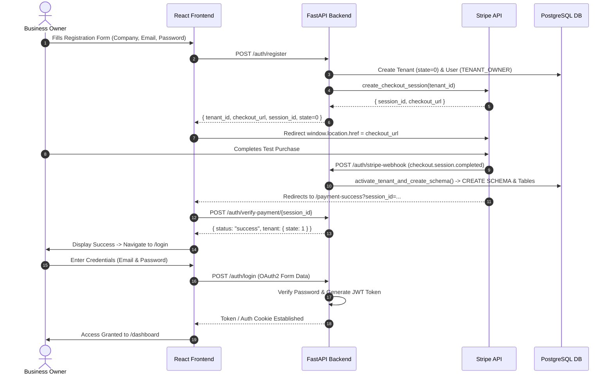

# FastAPI & React B2B POS Cloud Dashboard Authentication & Onboarding Specification

**File Path:** `docs/auth-flow-backend-frontend.md`  
**Date:** August 2026  
**Scope:** Architecture & API Contract between FastAPI Multi-Tenant Backend (`pos-engine`) and React Cloud Dashboard Frontend (`cloud-react-frontend`).

---

## 1. Overview & Architectural Principles

The Cloud Dashboard is a multi-tenant B2B POS SaaS application where each business entity (tenant) operates within an isolated PostgreSQL database schema (e.g. `schema_acme_coffee`).

### Key Security & Isolation Guarantees:
- **HttpOnly Cookie / Credentialed Transport:** JWT access tokens are issued by the backend and transported via credentialed requests (`withCredentials: true` in Axios). The frontend does **not** store JWT tokens in `localStorage`, `sessionStorage`, or JavaScript state.
- **Backend Authorization Authority:** The backend decodes and validates the JWT claims (`sub`, `user_id`, `tenant_id`, `schema_name`, `role`) on every request and dynamically scopes database operations using `SET search_path TO <schema_name>`.
- **Stripe-Driven Self-Serve Tenant Provisioning:** Tenant schemas are **never** provisioned synchronously upon initial registration form submission. Instead, tenant records are created in a `pending` state (state `0`), and schema creation is asynchronously triggered by Stripe Checkout webhooks (`checkout.session.completed`).

---

## 2. Authentication & Tenant Onboarding Flow



---

## 3. Endpoints & API Contracts

### 3.1 Tenant Registration (`POST /auth/register`)

- **URL:** `/auth/register`
- **Method:** `POST`
- **Content-Type:** `application/json`
- **Request Body:**
  ```json
  {
    "company_name": "Acme Coffee Shop",
    "email": "owner@acmecoffee.com",
    "password": "SecurePassword123!"
  }
  ```
- **Response (`200 OK`):**
  ```json
  {
    "tenant_id": 1,
    "company_name": "Acme Coffee Shop",
    "schema_name": "schema_acme_coffee_shop",
    "state": 0,
    "checkout_url": "https://checkout.stripe.com/c/pay/cs_test_...",
    "session_id": "cs_test_...",
    "message": "Registration pending payment. Please complete payment via Stripe to activate tenant schema."
  }
  ```

---

### 3.2 Stripe Webhook & Payment Verification

#### Production / Async Webhook (`POST /auth/stripe-webhook`)
- **URL:** `/auth/stripe-webhook`
- **Method:** `POST`
- **Headers:** `stripe-signature: <sig>`
- **Handler:** `activate_tenant_and_create_schema(db, tenant_id, session_id)`
  - Creates PostgreSQL schema `schema_<company_name>`.
  - Executes `tenant_schema.sql` DDL statements.
  - Updates tenant state from `0` (pending) to `1` (active).

#### Dev / Instant Verification Endpoint (`POST /auth/verify-payment/{session_id}`)
- **URL:** `/auth/verify-payment/{session_id}`
- **Method:** `POST`
- **Response (`200 OK`):**
  ```json
  {
    "status": "success",
    "message": "Payment verified. Tenant schema created and state updated to active (1).",
    "tenant": {
      "id": 1,
      "name": "Acme Coffee Shop",
      "schema_name": "schema_acme_coffee_shop",
      "state": 1
    }
  }
  ```

---

### 3.3 User Login (`POST /auth/login`)

- **URL:** `/auth/login`
- **Method:** `POST`
- **Content-Type:** `application/x-www-form-urlencoded`
- **Form Data:**
  - `username`: `owner@acmecoffee.com`
  - `password`: `SecurePassword123!`
- **Response (`200 OK`):**
  ```json
  {
    "access_token": "eyJhbGciOiJIUzI1NiIsInR5cCI6IkpXVCJ9...",
    "token_type": "bearer"
  }
  ```

---

## 4. Frontend Architecture Summary (`cloud-react-frontend`)

| Component / Layer | Location | Purpose |
| :--- | :--- | :--- |
| **Axios API Client** | [src/services/api.ts](file:///c:/Users/t/Desktop/Projects/Programming/POS%20SYSTEM/cloud-react-frontend/src/services/api.ts) | Centralized HTTP service configured with `withCredentials: true` and a 401 response interceptor. |
| **Auth Context** | [src/context/AuthContext.tsx](file:///c:/Users/t/Desktop/Projects/Programming/POS%20SYSTEM/cloud-react-frontend/src/context/AuthContext.tsx) | Provides `user`, `isAuthenticated`, `login`, `register`, `logout`, and `verifyPayment`. |
| **Protected Route** | [src/components/ProtectedRoute/ProtectedRoute.tsx](file:///c:/Users/t/Desktop/Projects/Programming/POS%20SYSTEM/cloud-react-frontend/src/components/ProtectedRoute/ProtectedRoute.tsx) | Displays a loading spinner during session checks and redirects unauthenticated users to `/login`. |
| **Login Page** | [src/features/auth/pages/LoginPage.tsx](file:///c:/Users/t/Desktop/Projects/Programming/POS%20SYSTEM/cloud-react-frontend/src/features/auth/pages/LoginPage.tsx) | B2B dark-themed login interface with form validation and error notifications. |
| **Register Page** | [src/features/auth/pages/RegisterPage.tsx](file:///c:/Users/t/Desktop/Projects/Programming/POS%20SYSTEM/cloud-react-frontend/src/features/auth/pages/RegisterPage.tsx) | Onboarding form handling Stripe Checkout redirection (`window.location.href`). |
| **Payment Success** | [src/features/auth/pages/PaymentSuccessPage.tsx](file:///c:/Users/t/Desktop/Projects/Programming/POS%20SYSTEM/cloud-react-frontend/src/features/auth/pages/PaymentSuccessPage.tsx) | Stripe return callback handler verifying schema activation before directing to login. |
| **Dashboard** | [src/pages/DashboardPage.tsx](file:///c:/Users/t/Desktop/Projects/Programming/POS%20SYSTEM/cloud-react-frontend/src/pages/DashboardPage.tsx) | Protected SaaS dashboard showcasing active tenant schema and user details. |

---

## 5. Notes & Future Backend Enhancements

> [!NOTE]
> **Super Admin Credentials Seeding:**
> Super Admin credentials will be seeded directly to the PostgreSQL database in later setup scripts. Super Admin users possess the `SUPER_ADMIN` role allowing access to cross-tenant management routes (`/tenants`).

> [!TIP]
> **Recommended FastAPI Cookie Endpoint Enhancements:**
> For pure HttpOnly cookie enforcement without returning tokens in JSON bodies, the backend `/auth/login` endpoint can be enhanced to issue a `Set-Cookie: access_token=...; HttpOnly; SameSite=Lax; Secure` header, alongside adding `/auth/me` and `/auth/logout` endpoints.
